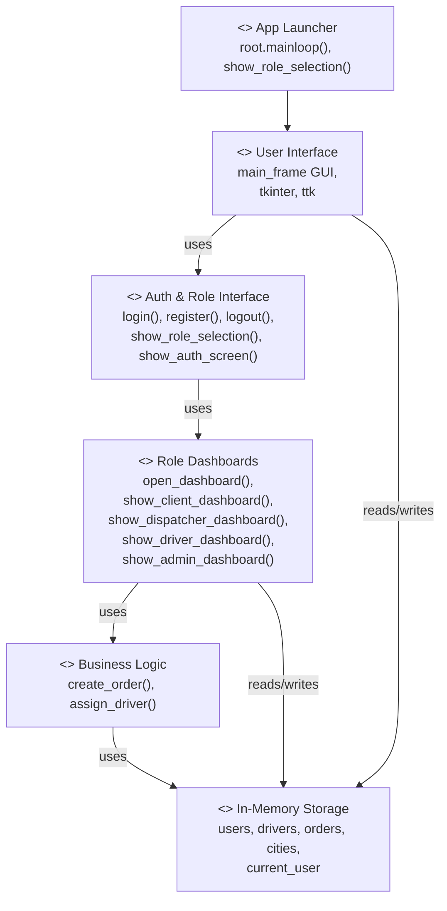

```mermaid
graph TD

%% Інтерфейс користувача
A1["<<component>> User Interface\nmain_frame GUI,\ntkinter, ttk"] -->|uses| A2["◯ Auth & Role Interface"]

%% Аутентифікація та ролі
A2["<<component>> Auth & Role Interface\nlogin(), register(), logout(),\nshow_role_selection(), show_auth_screen()"] -->|uses| A3["◯ Role Dashboards"]

%% Дашборди ролей
A3["<<component>> Role Dashboards\nopen_dashboard(),\nshow_client_dashboard(),\nshow_dispatcher_dashboard(),\nshow_driver_dashboard(),\nshow_admin_dashboard()"] -->|uses| A4["◯ Business Logic"]

%% Бізнес-логіка
A4["<<component>> Business Logic\ncreate_order(), assign_driver()"] -->|uses| A5["◯ In-Memory Storage"]

%% Зберігання даних
A5["<<component>> In-Memory Storage\nusers, drivers, orders, cities,\ncurrent_user"]

%% Операційна залежність
A1 -->|reads/writes| A5
A3 -->|reads/writes| A5

%% Ініціалізація системи
Init["<<component>> App Launcher\nroot.mainloop(), show_role_selection()"] --> A1
```
