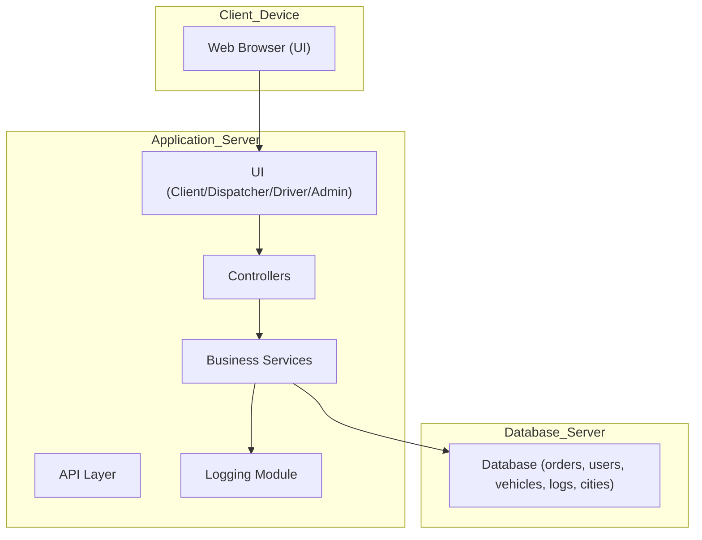

```mermaid
graph TD
  subgraph Client_Device
    Browser["Web Browser (UI)"]
  end

  subgraph Application_Server
    UI["UI (Client/Dispatcher/Driver/Admin)"]
    Controllers["Controllers"]
    Services["Business Services"]
    API["API Layer"]
    Logger["Logging Module"]
  end

  subgraph Database_Server
    DB["Database (orders, users, vehicles, logs, cities)"]
  end

  Browser --> UI
  UI --> Controllers
  Controllers --> Services
  Services --> DB
  Services --> Logger
```
